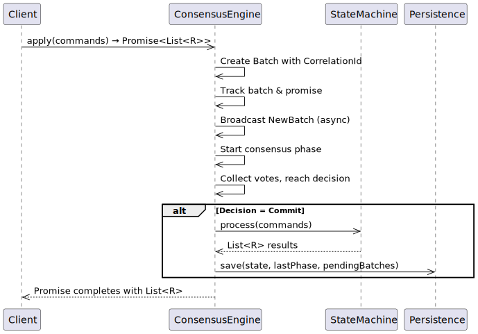
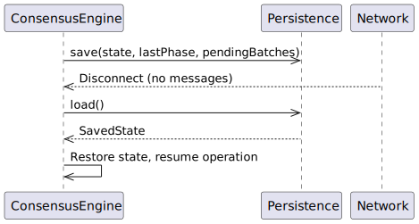

# Rabia Consensus Protocol Implementation

The implementation is message driven and split into several interacting parts:

- Protocol engine
- Networking
- Abstract state machine
- Message bus

### Sequence Diagrams

#### Rabia Protocol Message Processing 

<div hidden>

```
@startuml protocolEngine


participant Client
participant ConsensusEngine
participant StateMachine
participant Persistence

Client->>ConsensusEngine: apply(commands) → Promise<List<R>>
ConsensusEngine->>ConsensusEngine: Create Batch with CorrelationId
ConsensusEngine->>ConsensusEngine: Track batch & promise
ConsensusEngine->>ConsensusEngine: Broadcast NewBatch (async)
ConsensusEngine->>ConsensusEngine: Start consensus phase
ConsensusEngine->>ConsensusEngine: Collect votes, reach decision
alt Decision = Commit
    ConsensusEngine->>StateMachine: process(commands)
    StateMachine-->>ConsensusEngine: List<R> results
    ConsensusEngine->>Persistence: save(state, lastPhase, pendingBatches)
end
ConsensusEngine-->>Client: Promise completes with List<R>

@enduml

```
</div>



#### State Persistence During Disconnection/Reconnection

<div hidden>

```
@startuml statePersistence

participant ConsensusEngine
participant Persistence
participant Network

ConsensusEngine->>Persistence: save(state, lastPhase, pendingBatches)
ConsensusEngine<<--Network: Disconnect (no messages)
ConsensusEngine->>Persistence: load()
Persistence-->>ConsensusEngine: SavedState
ConsensusEngine->>ConsensusEngine: Restore state, resume operation

@enduml

```

</div>




#### Poem (generated by Code Rabbit)

```
  .-.
 (o o)   A cluster of nodes, now smarter and keen,
 ( = )   With batches and promises, errors well seen.
 /   \   Persistence for safety, new tests for the fight,
(__ __)  Consensus grows stronger, from morning to night.
  🥕      Debug logs are hopping, all systems in sync,
          The rabbits are cheering, “We’re better, we think!”
```
